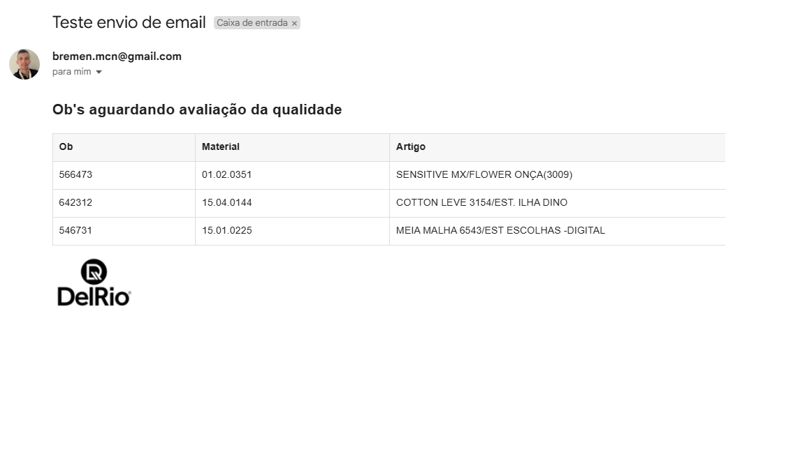

<h1 align="center"> Base da api para o envio de emails </h1>

<p align="center">
API em desenvolvimento para a automatização de envio de e-mails de forma automática. <br/>
</p>

<p align="center">
  <a href="#-tecnologias">Tecnologias</a>&nbsp;&nbsp;&nbsp;|&nbsp;&nbsp;&nbsp;
  <a href="#-requisitos">Requisitos</a>&nbsp;&nbsp;&nbsp;|&nbsp;&nbsp;&nbsp;
  <a href="#instalação">Instalação</a>&nbsp;&nbsp;&nbsp;|&nbsp;&nbsp;&nbsp;

</p>

<p align="center">
  
</p>

<br>

<p align="center">
  
</p>

## 🚀 Tecnologias

Esse projeto está em  desenvolvimento com as seguintes tecnologias:

- Golang
- Html e Css


## 💻 Requisitos

- **Golang**: Versão 1.18 ou superior
- **Biblioteca**: github.com/go-gomail/gomail : Pacote para enviar e-mails.

## ⚙️ Instalação

Clone o repositório e acesse a pasta `APIEmail`:

```bash
git clone: github.com/Marcos-Brhemem/EmailAPI.git
go mod download
go run main.go

Feito com ♥ by Marcos Brhemem 👊
